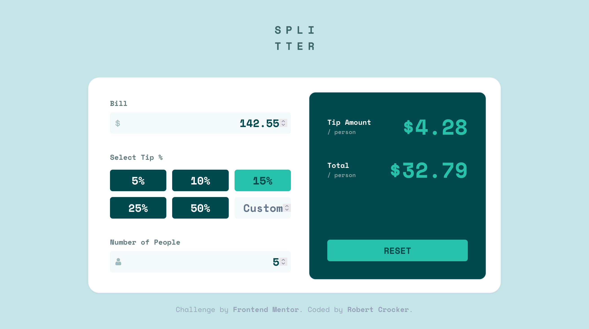

# Frontend Mentor - Tip calculator app solution

This is a solution to the [Tip calculator app challenge on Frontend Mentor](https://www.frontendmentor.io/challenges/tip-calculator-app-ugJNGbJUX). Frontend Mentor challenges help you improve your coding skills by building realistic projects.

## Table of contents

- [Overview](#overview)
  - [The challenge](#the-challenge)
  - [Screenshot](#screenshot)
  - [Links](#links)
- [My process](#my-process)
  - [Built with](#built-with)
  - [What I learned](#what-i-learned)
  - [Continued development](#continued-development)
  - [Useful resources](#useful-resources)
- [Author](#author)
- [Acknowledgments](#acknowledgments)

**Note: Delete this note and update the table of contents based on what sections you keep.**

## Overview

### The challenge

Users should be able to:

[] View the optimal layout for the app depending on their device's screen size
[] See hover states for all interactive elements on the page
[x] Calculate the correct tip and total cost of the bill per person

### Screenshot

### Links

- Solution URL: [Solution URL](https://github.com/robcrock/tip-calculator)
- Live Site URL: [Live Site](https://tip-calculator-pearl-iota.vercel.app/)

## My process

1. Scaffold the Next App
2. Remove Boilerplate
3. Add starter code from FEM
4. Get the app functional
5. Nail the Layout + Responsive
6. Nail the Font
7. Nail the color
8. Nail the interactivity

### Built with

- [Next.js](https://nextjs.org/) - React framework
- [Tailwind](https://tailwindcss.com/)
- [React Hook Form](https://react-hook-form.com/)
- [Zod](https://zod.dev/)
- [shadcn/ui](https://ui.shadcn.com/)
- [React](https://reactjs.org/)

### What I learned

This was the most interactive challene I have faced so far. I expected to create a form and call it a day, but the layout wasn't standard. This meant that I needed to use React Hook Form in ways I hadn't before. I was also using areas of shadcn that I hadn't been using before. All that to say, this was more challenging than I expected, but I appreciate the challenge because that's where the real learning happens.

### Continued development

I'm going to look for another form challenge to build out. I think they're great practice and I have a lot to learn about how to get the most out of shadcn/ui + NextJS and React Hook Form.

### Useful resources

- [Adding Icons to shadcn/ui Inputs](https://github.com/shadcn-ui/ui/discussions/1552) - This thread provided a great example of how to add icons to the shadcn input components.
- [svg2jsx](https://svg2jsx.com/) - This was a super simple way to convert SVGs to JSX components.

## Author

- Website - [Robert Crocker](https://www.robcrock.com)
- Frontend Mentor - [@robcrock](https://www.frontendmentor.io/profile/robcrock)
- Twitter - [@robcrock](https://twitter.com/robcrock)
- LinkedIn - [@robercrocker](https://www.linkedin.com/in/robertcrocker/)
